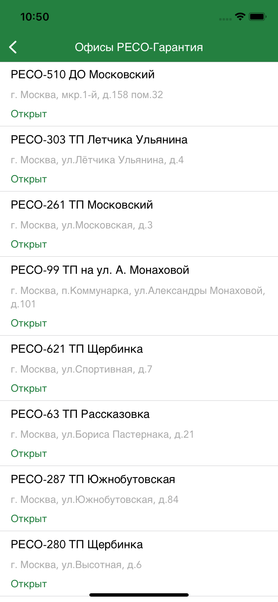

Решение тестового задания для собеседования.

## Описание приложения

Приложение получает список офисов компании в Москве.

Стартовый экран - навигейшнбар с двумя экранами.

Первый экран (кнопка) - кнопка для запроса списка офисов и перехода на следующий экран.

Второй экран (список) - таблица со списком офисов.

  
